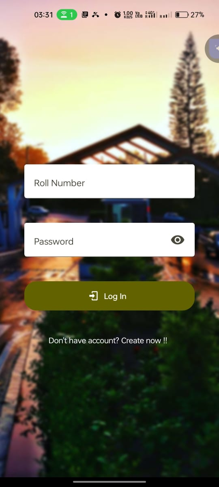
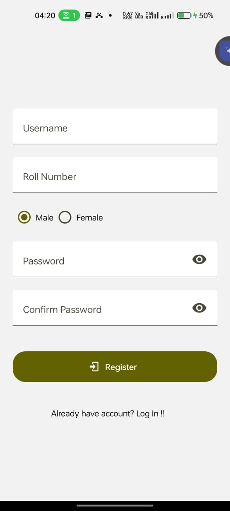
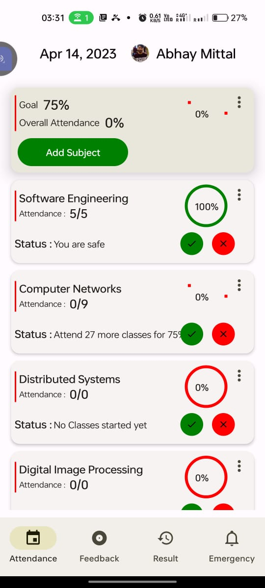
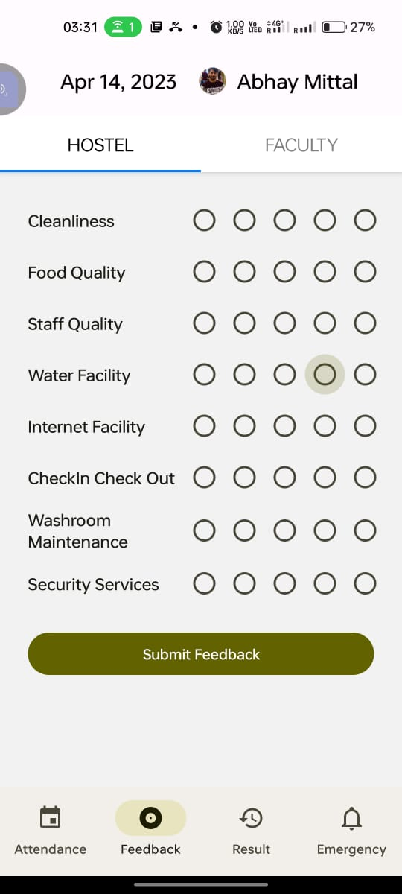
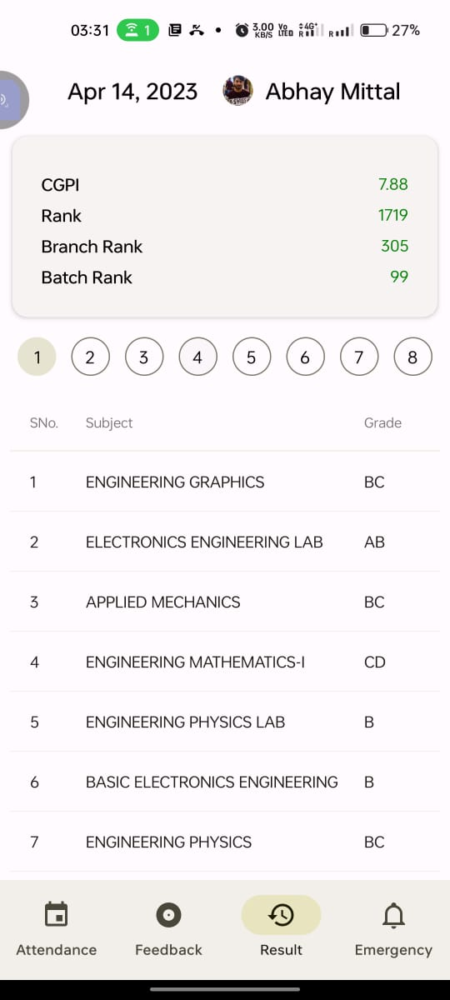
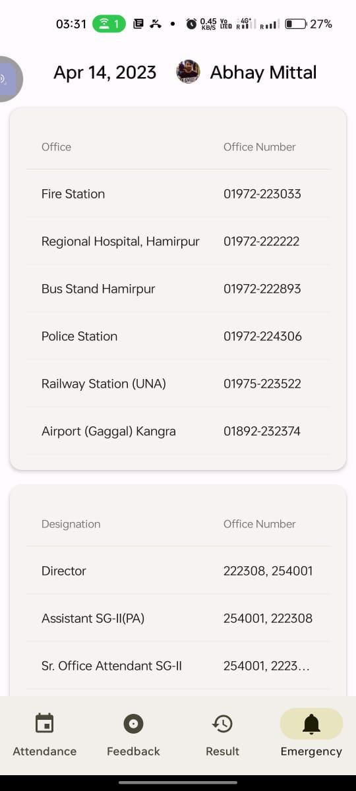

# PICA (A student Portal for [NITH](http://nith.ac.in/) )

<!-- ABOUT THE PROJECT -->

# About The Project

<div align="center">






</div>
<br />

Welcome to the Student Portal, a comprehensive platform
designed to cater to the academic needs of students, faculty, and
staff of our institute. This portal provides a range of features that
streamline academic processes, facilitate communication, and
promote collaboration among stakeholders.

- The Student Portal provides an easy-to-use attendance
  management system that enables students to keep track of
  their attendance records, view their attendance history, and
  get notified in case of any discrepancies. The system
  ensures that attendance data is accurate and accessible,
  enabling faculty and staff to make informed decisions
  regarding academic progress and student engagement.
- In addition to attendance management, the Student Portal
  also provides emergency contact information for the institute.
  This information includes contact numbers and addresses
  for emergency services, medical facilities, and key personnel
  in the institute. This feature ensures that students can
  access help in case of any emergency, and that institute
  authorities can respond quickly and effectively to any crisis
  situation.
- The Student Portal also provides a result management
  system that enables students to view their academic
  progress, including grades, course credits, and GPA. Thesystem ensures that result data is accurate, secure, and
  accessible, enabling students to make informed decisions
  about their academic pursuits and career goals.
- Finally, the Student Portal also provides a feedback
  submission system that enables students to provide
  feedback to faculty and hostel management. This system
  ensures that feedback is constructive, actionable, and timely,
  enabling faculty and staff to continuously improve their
  teaching, learning, and living environments.

Overall, the Student Portal is a powerful tool that enhances the
academic experience of students, faculty, and staff, promoting
transparency, accountability, and collaboration.

# What Tech Stack We have Used and Why?

- React Native : React Native is a popular framework for developing mobile applications using the JavaScript programming language. It allows developers to build high-quality, native mobile apps for iOS and Android platforms with a single codebase, making it a cost-effective and time-efficient solution for mobile app development. One of the biggest advantages of React Native is that it provides a platform-specific UI component for iOS and Android, which ensures that the app looks and feels native on both platforms. This means that developers can write code once and deploy it to multiple platforms, without compromising on the user experience.

- JavaScript/TypeScript : JavaScript is the language that React Native is built on and is an extremely popular programming language. It is a versatile language that can be used for a wide range of applications, including web development, server-side scripting, and mobile app development. JavaScript is also a powerful language that allows developers to build complex applications quickly and easily. It has a large and active community, which means that there are many resources available to help developers learn and solve problems.

<p align="right">(<a href="#top">back to top</a>)</p>

<!-- CONTRIBUTING -->

<!-- # CONTRIBUTION TO THIS PROJECT -->

# Run this project in your system

<!--
You can also Contribute to this project to make it more better and user friendly. -->

## Prerequisites

You need NodeJs installed in your system to run this project

- To check
  ```sh
  node -v
  ```

## Installation

Follow the following points to run this in your system

1.  Fork the repo
2.  Clone the repo
    ```sh
    git clone https://github.com/your_username_/Project-Name.git
    ```
3.  Enter in the project directory
    ```sh
    cd Project-Name
    ```
4.  Install dependencies
    ```sh
    npm i
    ```
5.  Configure the app from [react native documentation](https://reactnative.dev/).
6.  Build and Run it

<!-- ## Cuntribution Steps

Contributions are what make the open source community such an amazing place to learn, inspire, and create. Any contributions you make are **greatly appreciated**.
If you have a suggestion that would make this better, please fork the repo and create a pull request. You can also simply open an issue with the tag "enhancement".
Don't forget to give the project a star! Thanks again!

1. Fork the Project
2. Create your Feature Branch (`git checkout -b feature/AmazingFeature`)
3. Commit your Changes (`git commit -m 'Add some AmazingFeature'`)
4. Push to the Branch (`git push origin feature/AmazingFeature`)
5. Open a Pull Request -->

<!-- CONTACT -->

# Contact Us

- Abhay Kumar Mittal - [LinkedIn](https://www.linkedin.com/in/mitabhay/)
- Chaitanya Dhingra
- Parth Kaushik
- Ishaan Sharma
